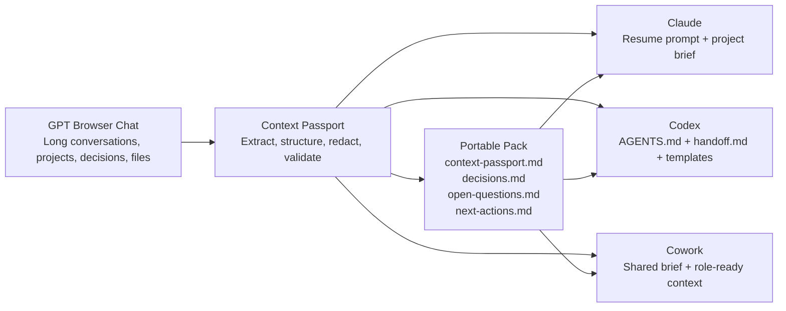

# Context Passport

Portable context packs for AI agents.

Context Passport turns long AI conversations, project chats, research threads, and agent sessions into structured handoff packs that can be reused in ChatGPT, Claude, Codex, Cursor, Gemini, or any other AI workspace.

It is not just a chat exporter. Exporters preserve the transcript. Context Passport extracts the operational memory: what happened, what was decided, what is still open, what the next agent must know, and how to resume without starting from zero.

## Why this exists

People often stay locked into one AI tool because "it already knows me" or because an important project lives inside a browser chat. That creates contextual lock-in: the knowledge exists, but it is trapped in a vendor-specific interface, memory system, or conversation history.

Context Passport proposes a simple alternative:

> Memory should not lock you into a tool. Your context should travel with you.

## How context moves



## Two use cases

### 1. Browser Chat To Context Passport

For people using ChatGPT, Claude, Gemini, or similar tools in the browser.

Use this when you have:

- a long chat with decisions and useful work;
- a ChatGPT Project or Claude Project you want to continue elsewhere;
- a research thread you want to reuse in another model;
- students or teams who think changing AI tools means losing all accumulated context.

Output examples:

- `context-passport.md`
- `project-brief.md`
- `decisions.md`
- `open-questions.md`
- `resume-prompt.md`

### 2. Agent Handoff Kit

For coding agents and local AI workspaces such as Codex, Claude Code, Cursor, Windsurf, Gemini CLI, and similar tools.

Use this when you want to transfer a project from one agent to another without losing:

- current task state;
- files changed;
- design decisions;
- implementation notes;
- blockers;
- verification status;
- next actions.

Output examples:

- `handoff.md`
- `CONTINUE.md`
- `AGENTS.md`
- `CLAUDE.md`
- `agent_context.json`

## Repository structure

```text
context-passport/
  README.md
  docs/
    product-strategy.md
  prompts/
    browser-chat-to-context-passport.md
    agent-session-to-handoff.md
  templates/
    context-passport.md
    agent-handoff.md
    resume-prompt.md
    CONTINUE.md
    AGENTS.md
    CLAUDE.md
  skills/
    create-context-passport/
      SKILL.md
  scripts/
    redact_sensitive.py
    validate_pack.py
```

## The method

Context Passport uses a five-step workflow.

1. **Capture**
   Collect the conversation, exported transcript, project notes, files, or agent session summary.

2. **Extract**
   Identify goals, decisions, facts, constraints, actors, deliverables, risks, pending questions, and current status.

3. **Structure**
   Convert messy context into a predictable Markdown pack.

4. **Adapt**
   Generate destination-specific files such as `AGENTS.md`, `CLAUDE.md`, `CONTINUE.md`, or a plain resume prompt.

5. **Validate**
   Check that the handoff is complete, actionable, source-aware, and safe to share.

## What makes a good passport

A good context passport should be:

- **portable**: readable by any AI tool and any human;
- **actionable**: the next agent knows what to do next;
- **traceable**: important facts point back to their origin when possible;
- **bounded**: it separates confirmed facts from assumptions;
- **safe**: secrets and sensitive data are removed or flagged;
- **fresh**: it captures current status, not only history.

## Quick start

Use the prompts in `prompts/` directly in your current AI chat, or use the Codex skill in `skills/create-context-passport/`.

For browser chats:

```text
Use prompts/browser-chat-to-context-passport.md on this conversation and generate a Context Passport pack.
```

For agent sessions:

```text
Use prompts/agent-session-to-handoff.md and generate an Agent Handoff Kit for this project.
```

## Early status

This repository starts as a practical method, template library, and Codex plugin scaffold. It intentionally does not depend on any private API or browser scraping. Automation can be added later through:

- browser extensions;
- local CLI importers;
- MCP servers;
- connectors for ChatGPT, Claude, or other export formats;
- repository-aware agent integrations.

## Positioning

One-line pitch:

> Context Passport converts messy AI history into portable, structured context for your next agent.

Portuguese version:

> Context Passport transforma historicos longos de IA em contexto estruturado e portavel para continuar o trabalho em qualquer agente.

## License

MIT.
