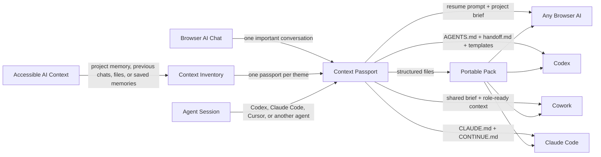

# Context Passport

Move an AI conversation from one tool to another without losing context.

Context Passport turns long AI conversations, project chats, research threads, and agent sessions into structured handoff packs that can be reused in ChatGPT, Claude, Codex, Cursor, Gemini, or any other AI workspace.

It is not just a chat exporter. Exporters preserve the transcript. Context Passport extracts the operational memory: what happened, what was decided, what is still open, what the next agent must know, and how to resume without starting from zero.

## Why this exists

People often stay locked into one AI tool because "it already knows me" or because an important project lives inside a browser chat. That creates contextual lock-in: the knowledge exists, but it is trapped in a vendor-specific interface, memory system, or conversation history.

Context Passport proposes a simple alternative:

> Memory should not lock you into a tool. Your context should travel with you.

## How context moves



## Start here if you only use AI in the browser

You do not need to install anything.

You do not need Git, a plugin, an API key, or technical setup.

Use Context Passport with copy and paste. There are two browser modes.

### Mode 1: one important chat

Use this when the context is mainly inside one long conversation.

1. Open an important chat in ChatGPT, Claude, Gemini, or another AI tool.
2. Select the strongest model or reasoning mode available for that tool, especially for long or mixed-topic chats.
3. Copy the prompt from [`prompts/browser-chat-to-context-passport.md`](prompts/browser-chat-to-context-passport.md).
4. Paste it into the same chat and ask the AI to generate your Context Passport.
5. In ChatGPT, ask for a downloadable `context-passport.md` file when available.
6. If the tool does not create a file, copy the Markdown block from the chat and save it as `context-passport.md`, or paste it directly into the next AI tool.
7. Open another AI tool and paste the resume prompt from the end of the passport.
8. Attach or paste `context-passport.md` so the new AI can continue with the same context.

That is the simplest version:

> source chat -> Context Passport -> destination AI

If the chat mixes many subjects, Context Passport should first create a **Topic Map** and ask which topic should be exported first. Then it generates one passport per topic, instead of mixing unrelated work into one confusing file.

Important: if the original chat is extremely long or depends on attachments the AI can no longer access, the first passport may be incomplete. In that case, create a Topic Map first, paste the missing source material, and regenerate the passport for one topic at a time.

### Mode 2: accessible context scan

Use this when your context is spread across a ChatGPT Project, Claude Project, previous chats, saved memories, uploaded files, or a workspace that can reference prior work.

1. Open a new chat in the tool that already has the context.
2. Select the strongest model or reasoning mode available.
3. Copy the prompt from [`prompts/accessible-context-to-context-passport.md`](prompts/accessible-context-to-context-passport.md).
4. Ask for a **Context Inventory** first.
5. Review the topics, confidence levels, gaps, and suggested manual search terms.
6. Pick the topic you want to transfer.
7. Ask the AI to generate `context-passport-[topic].md`.
8. Take that passport to the next AI tool.

This is the broader workflow:

> accessible project/history context -> Context Inventory -> focused Context Passport -> destination AI

Important: this is not a promise of perfect export from every platform. The AI can only use context the product, plan, memory settings, project settings, and current chat actually make available. If the inventory has gaps, use the original tool's search, paste missing excerpts, or move relevant chats/files into the project before generating the final passport.

Model choice matters. A fast/default model can work for simple chats, but important handoffs benefit from the most capable model or reasoning setting available. In ChatGPT, use Thinking, higher reasoning effort, or Pro when available for long, sensitive, or mixed-topic conversations.

The browser version does not depend on folder access or one-click automation. ChatGPT, Claude, and Gemini all have documented file-generation or file-download paths in supported surfaces, but details vary by tool, plan, workspace, file type, and interface. If a real file is created, download it. If not, use the copy/paste fallback. The assistant should never invent a fake download link.

### Prompt in Portuguese

If your audience is Portuguese-speaking, use:

[`prompts/pt-BR/chat-do-browser-para-context-passport.md`](prompts/pt-BR/chat-do-browser-para-context-passport.md)

For the accessible-context scan mode, use:

[`prompts/pt-BR/contexto-acessivel-para-context-passport.md`](prompts/pt-BR/contexto-acessivel-para-context-passport.md)

Portuguese quick guide:

[`docs/pt-BR/como-usar-no-browser.md`](docs/pt-BR/como-usar-no-browser.md)

## Two use cases

### 1. Browser Chat To Context Passport

For people using ChatGPT, Claude, Gemini, or similar tools in the browser.

Use this when you have:

- a long chat with decisions and useful work;
- a ChatGPT Project or Claude Project you want to continue elsewhere;
- context spread across accessible project memory, previous chats, files, or saved memories;
- a research thread you want to reuse in another model;
- students or teams who think changing AI tools means losing all accumulated context.

Output examples:

- `context-inventory.md`
- `context-passport.md`
- `project-brief.md`
- `decisions.md`
- `open-questions.md`
- `resume-prompt.md`

### 2. Agent Handoff Kit

For coding agents and local AI workspaces such as Codex, Claude Code, Cursor, Windsurf, Gemini CLI, and similar tools.

Use this when you want to transfer a project from one agent to another without losing:

- current task state;
- files changed;
- design decisions;
- implementation notes;
- blockers;
- verification status;
- next actions.

Output examples:

- `handoff.md`
- `CONTINUE.md`
- `AGENTS.md`
- `CLAUDE.md`
- `agent_context.json`

## Repository structure

```text
context-passport/
  README.md
  docs/
    product-strategy.md
    references.md
    pt-BR/
      como-usar-no-browser.md
  prompts/
    browser-chat-to-context-passport.md
    accessible-context-to-context-passport.md
    agent-session-to-handoff.md
    pt-BR/
      chat-do-browser-para-context-passport.md
      contexto-acessivel-para-context-passport.md
  templates/
    topic-map.md
    context-inventory.md
    context-passport.md
    agent-handoff.md
    resume-prompt.md
    CONTINUE.md
    AGENTS.md
    CLAUDE.md
  skills/
    create-context-passport/
      SKILL.md
  scripts/
    redact_sensitive.py
    validate_pack.py
```

## The method

Context Passport uses a five-step workflow.

1. **Capture**
   Collect the conversation, exported transcript, project notes, files, or agent session summary.

2. **Extract**
   Identify goals, decisions, facts, constraints, actors, deliverables, risks, pending questions, and current status.

3. **Structure**
   Convert messy context into a predictable Markdown pack.

4. **Adapt**
   Generate destination-specific files such as `AGENTS.md`, `CLAUDE.md`, `CONTINUE.md`, or a plain resume prompt.

5. **Validate**
   Check that the handoff is complete, actionable, source-aware, and safe to share.

## What makes a good passport

A good context passport should be:

- **portable**: readable by any AI tool and any human;
- **actionable**: the next agent knows what to do next;
- **traceable**: important facts point back to their origin when possible;
- **bounded**: it separates confirmed facts from assumptions;
- **safe**: secrets and sensitive data are removed or flagged;
- **fresh**: it captures current status, not only history.

## Quick start

Use the prompts in `prompts/` directly in your current AI chat, or use the Codex skill in `skills/create-context-passport/`.

For browser chats:

```text
Use prompts/browser-chat-to-context-passport.md on this conversation and generate a Context Passport pack.
```

For context spread across a project, memory, files, or accessible previous chats:

```text
Use prompts/accessible-context-to-context-passport.md and create a Context Inventory before generating any Context Passport.
```

In Portuguese:

```text
Use prompts/pt-BR/chat-do-browser-para-context-passport.md nesta conversa e gere um Context Passport.
```

Or, for accessible context discovery:

```text
Use prompts/pt-BR/contexto-acessivel-para-context-passport.md para criar primeiro um Inventario de Contexto.
```

For agent sessions:

```text
Use prompts/agent-session-to-handoff.md and generate an Agent Handoff Kit for this project.
```

## Early status

This repository starts as a practical method, template library, and Codex plugin scaffold. It intentionally does not depend on any private API or browser scraping. Automation can be added later through:

- browser extensions;
- local CLI importers;
- MCP servers;
- connectors for ChatGPT, Claude, or other export formats;
- repository-aware agent integrations.

## References

See [`docs/references.md`](docs/references.md) for official references related to file generation, file downloads, model choice, and Mermaid rendering on GitHub.

## Positioning

One-line pitch:

> Context Passport converts messy AI history into portable, structured context for your next agent.

Portuguese version:

> Context Passport transforma historicos longos de IA em contexto estruturado e portavel para continuar o trabalho em qualquer agente.

## License

MIT.
